# Satellite Demo - Food Delivery

Food Delivery is a cloud native microservices based application leveraging multiple common cloud native opensource projects to develop a simulated version of an UberEats/GrubHub type business. The application uses OpenShift, Kafka, Redis, and MongoDB as it's base set of middleware and adds set of domain specific middleware and an API front end. 

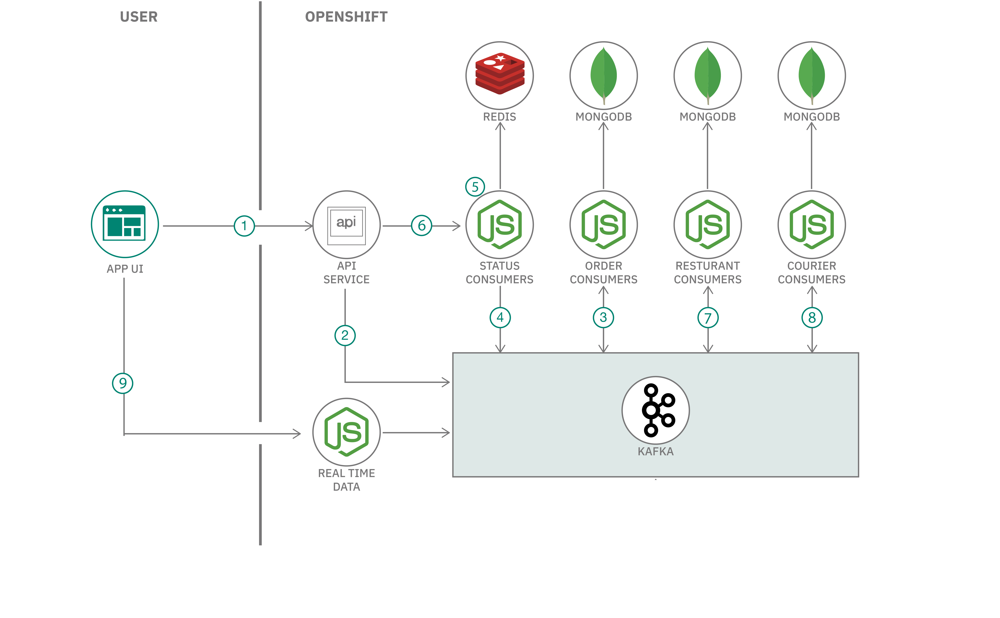

>TODO:
>- remove KEDA reference
>- bound the OCP cluster with a Satellite Location

## History and Reference

This set of assets is based on the material used at the Digital Developer Conference: Hybrid Cloud Labs and the IBM Cloud Community Days Conference. You can reference details on the workshops here: https://anthonyamanse.gitbook.io/ibm-satellite-workshop/

The base application itself was developed by Yan Koyfam and Anthony Amaranse and published here: https://github.com/IBM/scaling-apps-with-kafka. It was later modified to remove the dependance on Confluent.

## Setup

The main demo script assumes you have a Satellite Location set up with three (3) ROKS clusters for _dev, test, and production_.

The _deployments_ folder contains the YAML files used to deploy the application. You need to edit and change the `{{YOUR_NAMESPACE}}` and `{{CLUSTER_DOMAIN_NAME}}` tokens to use the namespace and cluster URL for your demo system.

This can be done manually (there are only a few files), you can use `Find and Replace` to find every instance of `{{YOUR_NAMESPACE}}` and `{{CLUSTER_DOMAIN_NAME}}` and replace them in the project directory or use something like mustache to preprocess the YAML files and make the substitutions. If you are using mustache or something similar the file `config.yaml` is used as a configuration file.

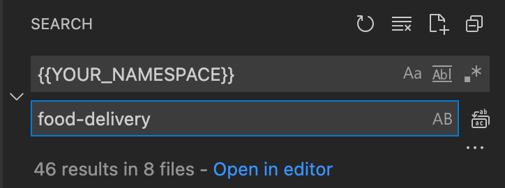

Setup will take 5-10 minutes typically once you have the Location with multiple clusters set up

## Demo Walkthrough

You can see a walkthrough of the Satellite Config demo utilizing the Food Delivery app here: 

[Demo Walkthrough](https://ibm.box.com/s/gmp2tr21r9xszbg3t592fg8ypg43879o)

- Create Cloud Satellite cluster groups. One cluster group for `dev-qa` and another cluster group for `prod`. Add the appropriate clusters to the cluster groups.

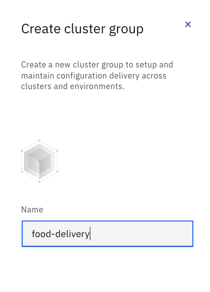

- Create a Cloud Satellite configuration, open the configuration and create a version using the `kafka-mongo-redis.yaml` file and name it something recognizable such as `kafka-mongo-redis`, repeat this creation of versions for all files in the deployment folder. 

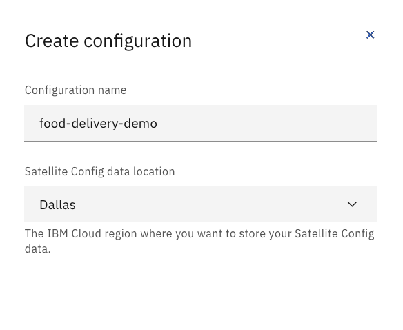

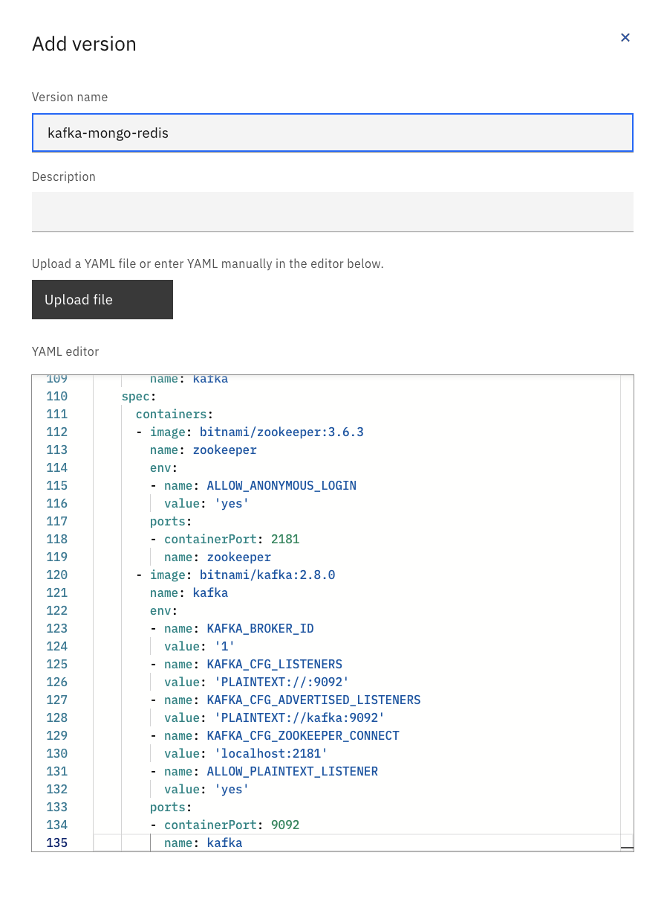

- Open the Cloud Satellite configuration for this project and create a version for each `route.yaml` file within each of the `route` folders.
- Create a Cloud Satellite subscription for the routes labeled with the route's name, such as `route-dev` and `route-prod`, choose the associated versions and add to the appropriate cluster group(s). 

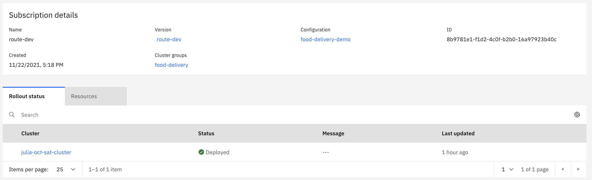

- Create a Cloud Satellite subscription labeled `kafka-mongo-redis-on-all-clusters`, choose the version  `kafka-mongo-redis` and add the cluster group(s).

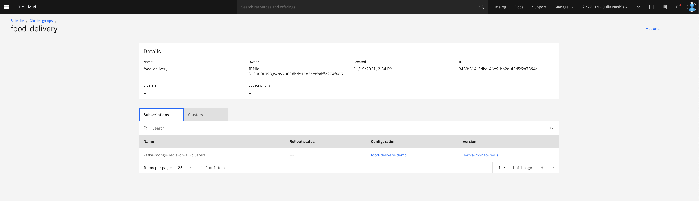

- Check `Pods` within the cluster(s) to see if the services are running.

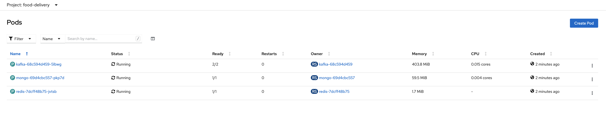

- Create a Cloud Satellite subscription labeled `backend-microservices-on-all-clusters`, choose the version `backend-microservices` and add the cluster group(s).

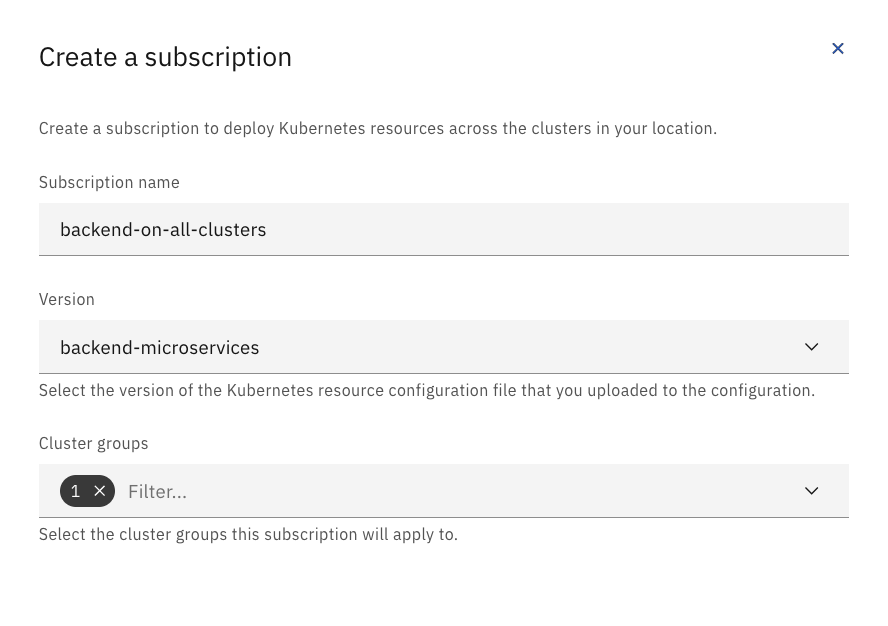

- Check `Pods` within the cluster(s) to see if the services are running.
- Create a Cloud Satellite subscription labeled `frontend-on-dev-qa-clusters`, choose the version `frontend-v1` and add the `dev-qa` cluster group.
- Check `Pods` within the cluster(s) to see if the services are running.
- Create a Cloud Satellite subscription labeled `frontend-on-prod-cluster`, choose the version `frontend-v2` and add the `prod` cluster group.
- Go to `Routes` in your cluster(s) and find the `example-food` route. Open the URL.

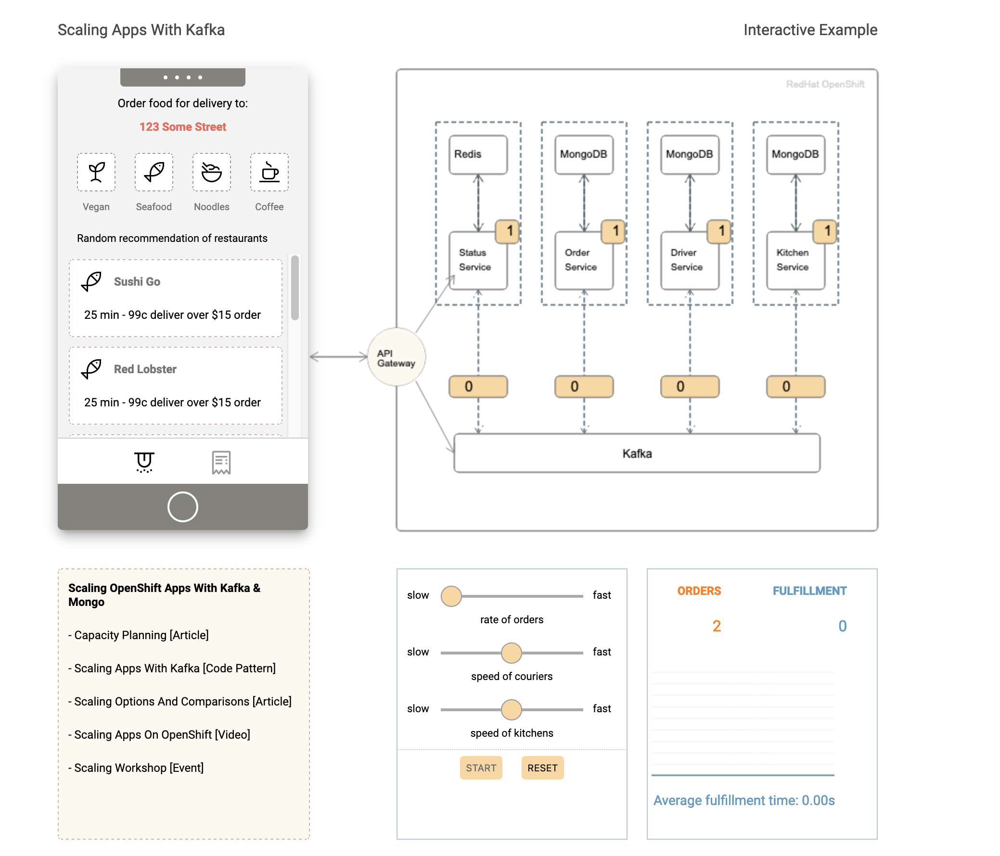

- Now we will show updates to the application by switching from a frontend light theme (`frontend-v1`) to a dark theme (`frontend-v2`).
- If the `frontend-v2` version is already created in your project's configuration, then skip this step. Open the project's Cloud Satellite Configuration and select `Versions` from the sidenav bar. Find the `frontend-v1` version and open the ellipsis to select `Duplicate`. Change the title to `frontend-v2` and the `- image: anthonyamanse/example-food-frontend:1.0.ddc` to `- image: anthonyamanse/example-food-frontend:2.0.ddc`. Press `Add`.
- Go into the Cloud Satellite subscriptions. Update the `frontend-on-dev-qa-clusters` subscription to the `frontend-v2` version and press `Save`. 

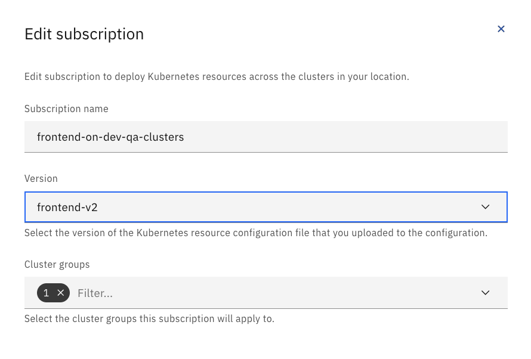

- Look at `Pods` to see a new `example-food` deployment configured (frontend-v2) and another deployment (frontend-v1) terminating. 

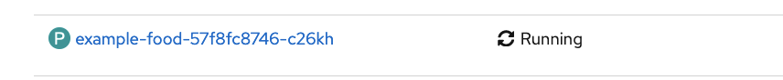

- Once the `frontend-v1` deployment terminates, open the `example-food` application route again and view the application to see the update to the dark theme that `frontend-v2` configured. 
- The `frontend-v1`  light theme can be configured to the `prod` cluster by the creation of a subscription labeled `frontend-on-prod-cluster` to show the difference of the configured theme between the `dev-qa` and `prod` clusters.

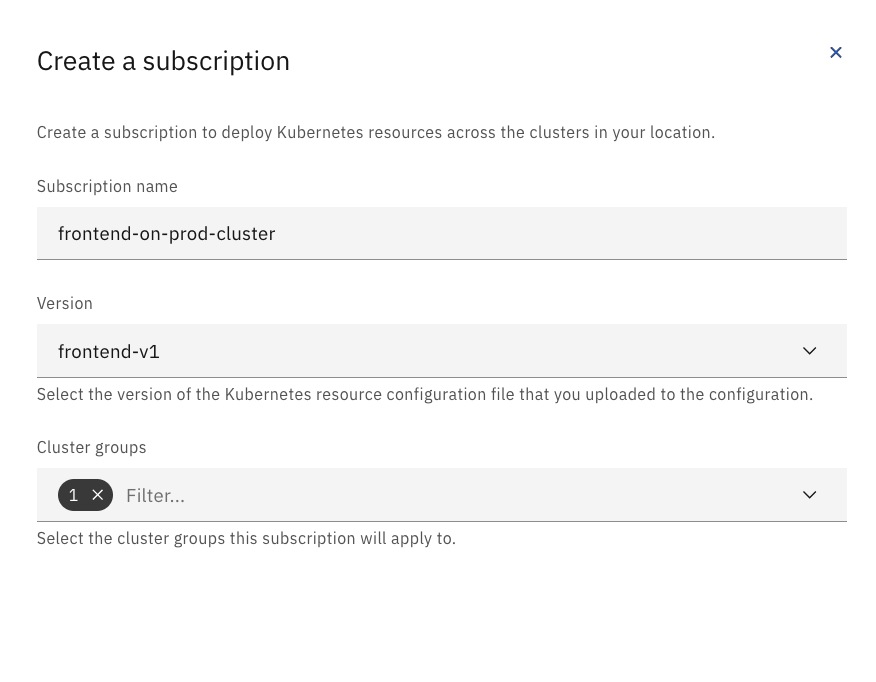

- Press `Start` on the management controls panel in the `example-food` GUI to increase the `Order` quantity.
- Adjust the controls to have a higher rate of food orders, increase the speed of the couriers and kitchens.

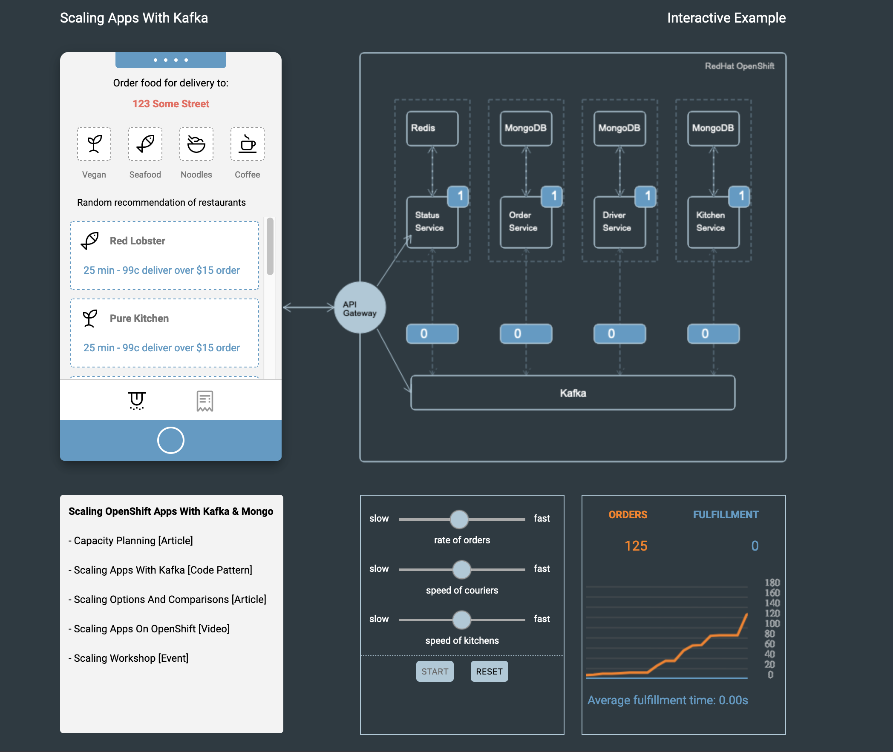

This demonstration shows the near-to instant update of an application via Cloud Satellite Config.